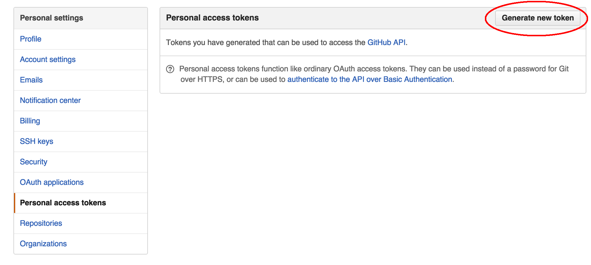

# PullRequests-Categorizer
categorize and show pull requests

# Installation
```
npm install -g gulp
git clone git@github.com:sairoutine/pullrequests-categorizer.git
cd pullrequests-categorizer
npm install
```

# How to build
If you have configured or customized categorize method, You must build js files.

```
gulp build
```

# Get OAuth Token
To configure, You need to get Github OAuth Token.




# Configuration

```
vim src/js/config.js
```

In config.js

```
module.exports = {
	"apiUrl": "",
	"token": "",
	"auth": "oauth",
	"repouser": "",
	"reponame": ""
};
```

| param    |                                                                         |
|----------|-------------------------------------------------------------------------|
| apiUrl   | Github API URL. Default: https://api.github.com/                        |
| token    | OAuth Token. You must make OAuth Token to use pullrequests-categorizer. |
| repouser | user name which has repository                                          |
| reponame | repository name                                                         |

# Customize categorize method

To change categorize name and method, you should edit `categorize_pulrequests.js`

```
vim src/js/categorize_pullrequests.js
```

`get_category_name` method receives a pull request data and returns category_name.

pullrequests-categorizer categorize pull request by this category_name.

see pull request data format.
https://developer.github.com/v3/pulls/#list-pull-requests


